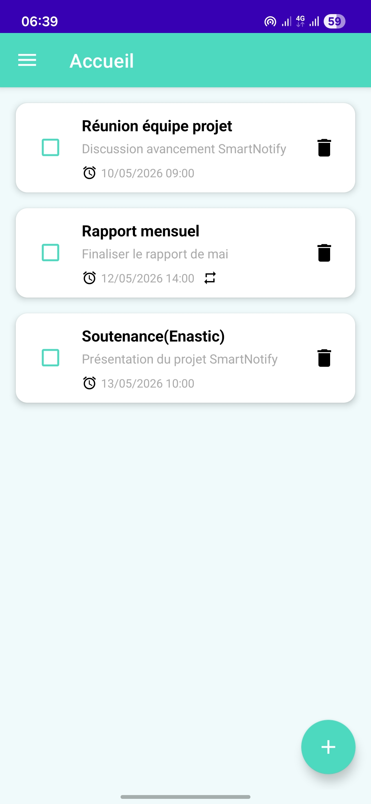
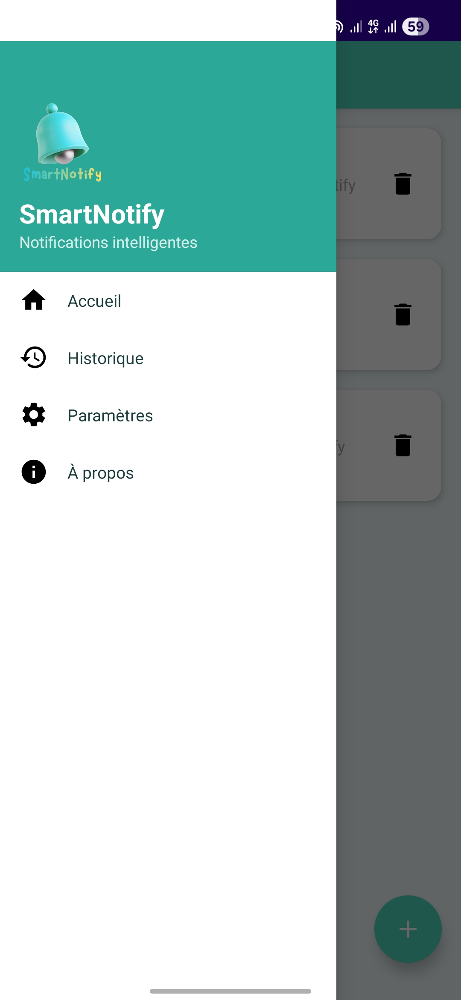
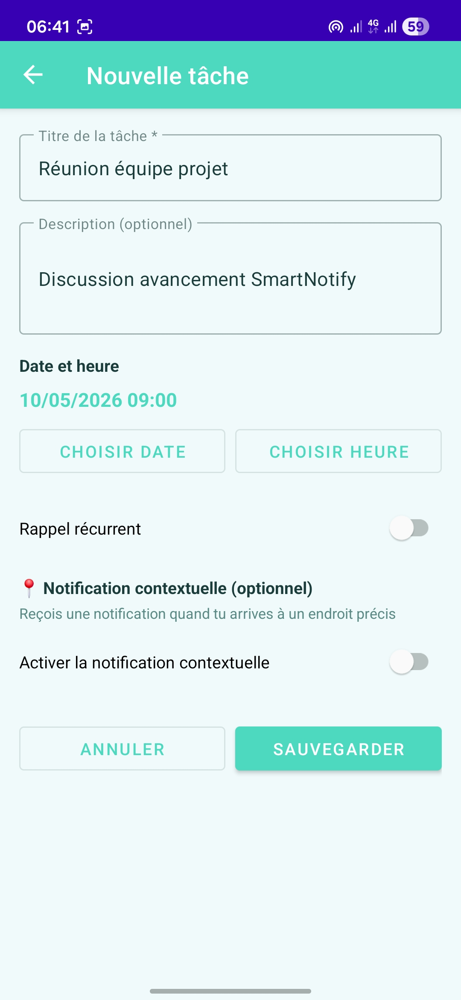
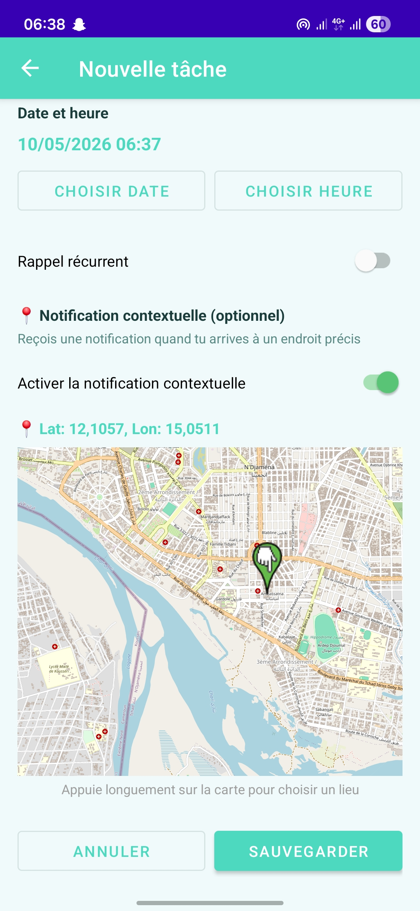
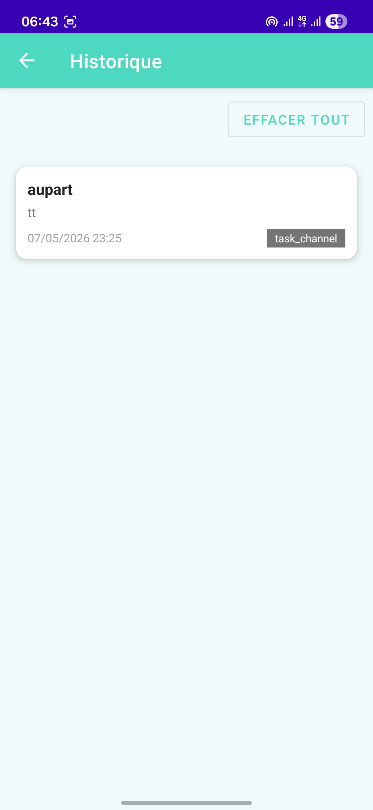
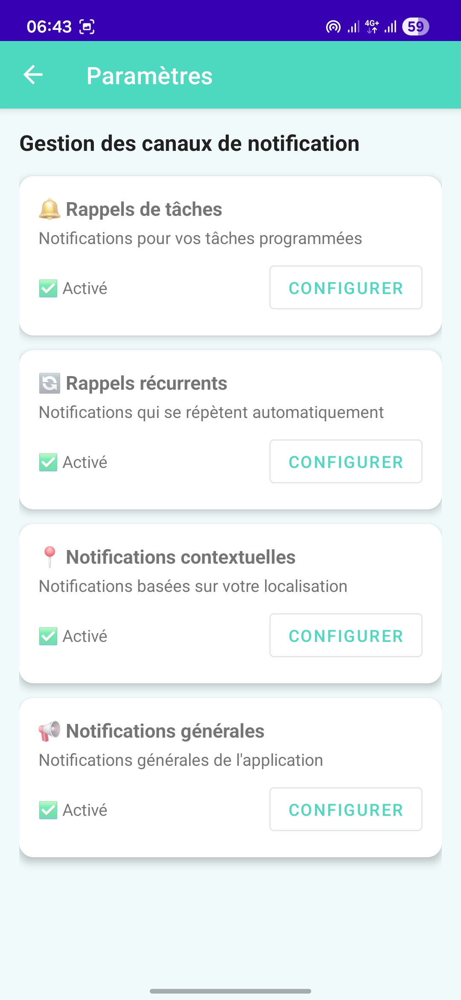
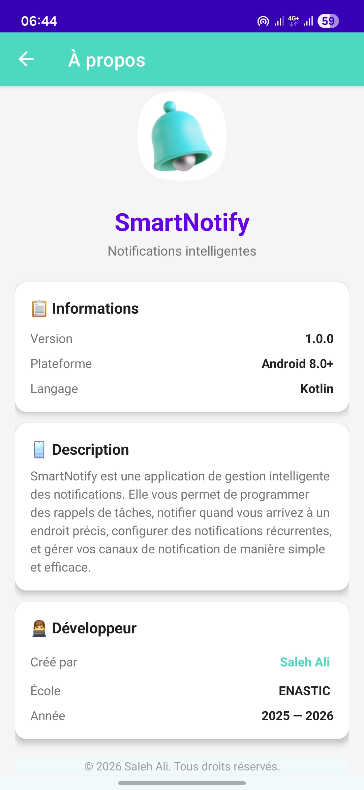

# 📱 SmartNotify


> Application Android de gestion intelligente des notifications — Projet n°47

---

## 📖 Description

SmartNotify est une application mobile Android développée en Kotlin dans le cadre du projet de fin d'études à l'**ENASTIC** (École Nationale Supérieure des Technologies de l'Information et de la Communication).

Elle offre une gestion complète et intelligente des notifications grâce à quatre fonctionnalités principales :

- 🔔 **Notifications programmées** — Recevez des rappels à une date et heure précises
- 🔄 **Rappels récurrents** — Configurez des notifications qui se répètent automatiquement
- 📍 **Notifications contextuelles** — Recevez une notification quand vous arrivez à un endroit précis (Geofencing)
- 📢 **Gestion des canaux** — Contrôlez et personnalisez chaque type de notification

---

## ✨ Fonctionnalités

| Fonctionnalité | Description |
|---|---|
| ➕ Créer une tâche | Titre, description, date/heure, lieu |
| ✅ Marquer comme complétée | Tâche grisée + notification annulée |
| 🗑️ Supprimer une tâche | Suppression + annulation notification |
| 🔔 Notification programmée | Fonctionne écran éteint et en arrière-plan |
| 🔄 Rappel récurrent | Intervalle personnalisable en minutes |
| 📍 Geofencing | Notification à l'arrivée sur un lieu |
| 📋 Historique | Consulter toutes les notifications envoyées |
| ⚙️ Paramètres | Configurer chaque canal de notification |
| 🌙 Mode sombre | Interface adaptive automatiquement |

---

## 🏗️ Architecture

MVVM (Model - View - ViewModel)
├── Model
│   ├── Entity (Task, NotificationHistory)
│   ├── DAO (TaskDao, NotificationHistoryDao)
│   ├── Repository (TaskRepository, NotificationRepository)
│   └── AppDatabase (Room)
├── View
│   ├── MainActivity
│   ├── HomeFragment
│   ├── AddTaskFragment
│   ├── HistoryFragment
│   ├── SettingsFragment
│   └── AboutFragment
├── ViewModel
│   ├── TaskViewModel
│   └── NotificationViewModel
└── Services
├── AlarmReceiver
├── GeofenceReceiver
├── BootReceiver
├── NotificationWorker
└── NotificationScheduler

---

## 🛠️ Technologies utilisées

| Technologie | Version | Usage |
|---|---|---|
| Kotlin | 1.9.22 | Langage principal |
| Room Database | 2.6.1 | Base de données locale |
| ViewModel + LiveData | 2.7.0 | Architecture MVVM |
| AlarmManager | Android API | Notifications précises |
| WorkManager | 2.9.0 | Tâches en arrière-plan |
| Geofencing API | 21.2.0 | Notifications contextuelles |
| OSMDroid | 6.1.17 | Carte OpenStreetMap |
| Navigation Component | 2.8.9 | Navigation entre écrans |
| Material Design | 1.11.0 | Interface utilisateur |

---

## 📱 Captures d'écran

> <div align="center">

| Accueil | Menu Drawer | Créer une tâche |
|:---:|:---:|:---:|
|  |  |  |

| Carte Geofencing | Historique | Paramètres |
|:---:|:---:|:---:|
|  |  |  |

| À propos |
|:---:|
|  |

</div>

---

## 🚀 Installation

### Méthode 1 — APK direct
1. Télécharger `app-release.apk` depuis la section [Releases](https://github.com/Authentic0502/SmartNotify/releases)
2. Activer "Sources inconnues" sur votre téléphone
3. Installer l'APK

### Méthode 2 — Android Studio
1. Cloner le dépôt :
```bash
git clone https://github.com/Authentic0502/SmartNotify.git
```
2. Ouvrir dans Android Studio
3. Connecter un appareil Android 8.0+
4. Lancer avec **Run**

---

## 📋 Prérequis

- Android 8.0 (API 26) minimum
- Google Play Services installé (pour le Geofencing)
- GPS activé (pour les notifications contextuelles)
- Permission localisation "Toujours autoriser" (pour le Geofencing)

---

## 👨‍💻 Auteur

**Saleh Ali Abisso**

- 🏫 ENASTIC — Génie Logiciel L3
- 📅 Année académique : 2025-2026
- 👨‍🏫 Encadreur : M. Brahim Issa
- 🐙 GitHub : [@Authentic0502](https://github.com/Authentic0502)

---

## 📄 Licence

Ce projet est sous licence [MIT](LICENSE).

---

*© 2025 Saleh Ali Abisso — ENASTIC*
